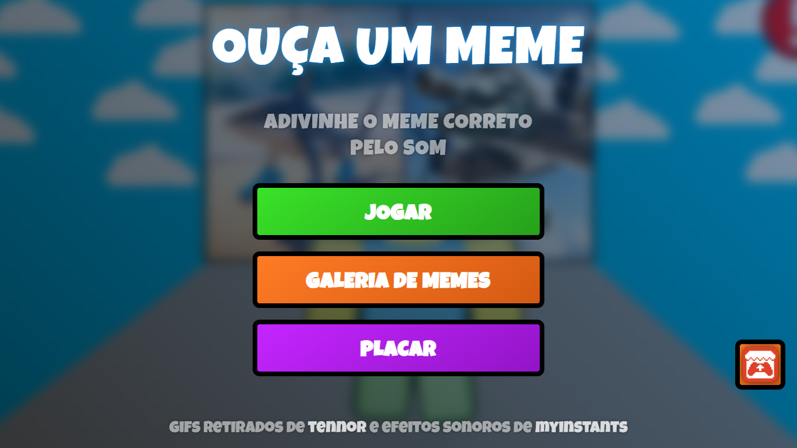
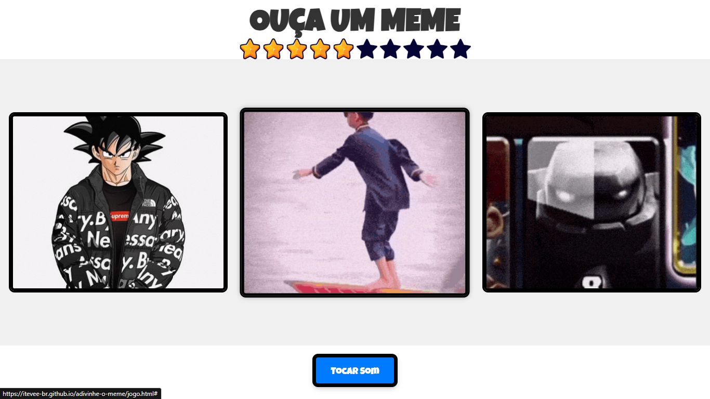
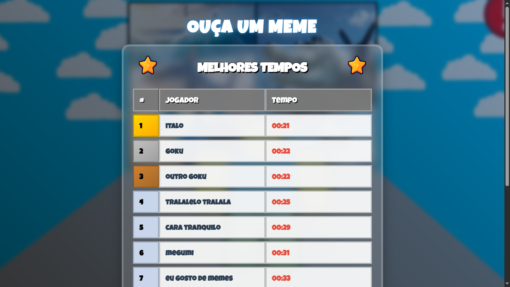

# 🎮 Adivinhe o Meme pelo Som

Um jogo inspirado nos mini jogos do Roblox onde você precisa adivinhar o meme correto apenas pelo som!

## 🎯 Como Jogar

1. Escute o som que será reproduzido
2. Selecione o meme correto baseado no som
3. Tente terminar no menor tempo possivel
4. dispute pelo primeiro lugar no placar online!

## 📸 Screenshots

### Menu Principal

### Tela do Jogo

### Placar de Pontuações

## 🚀 Tecnologias Utilizadas

- **HTML5** - Estrutura do projeto
- **CSS3** - Estilização e design responsivo
- **JavaScript** - Interatividade e lógica do jogo
- **Supabase** - Banco de dados em tempo real

## 📋 Funcionalidades

- 🔊 Reprodução de sons de memes
- 🎯 Sistema de pontuação em tempo real
- 🏆 Ranking online com placar
- 🎨 Interface inspirada no estilo Roblox

## 🗄️ Integração com Banco de Dados

Este projeto utiliza **Supabase** para armazenar as pontuações dos jogadores, demonstrando como conectar um banco de dados com JavaScript puro.
Como é um projeto pessoal, e um plano gratuito do banco de dados, não me preoucupei em protejer as key da api.

## 🌐 Acesso Online

O jogo está disponível em: [clique aqui](https://itevee-br.github.io/adivinhe-o-meme/)
